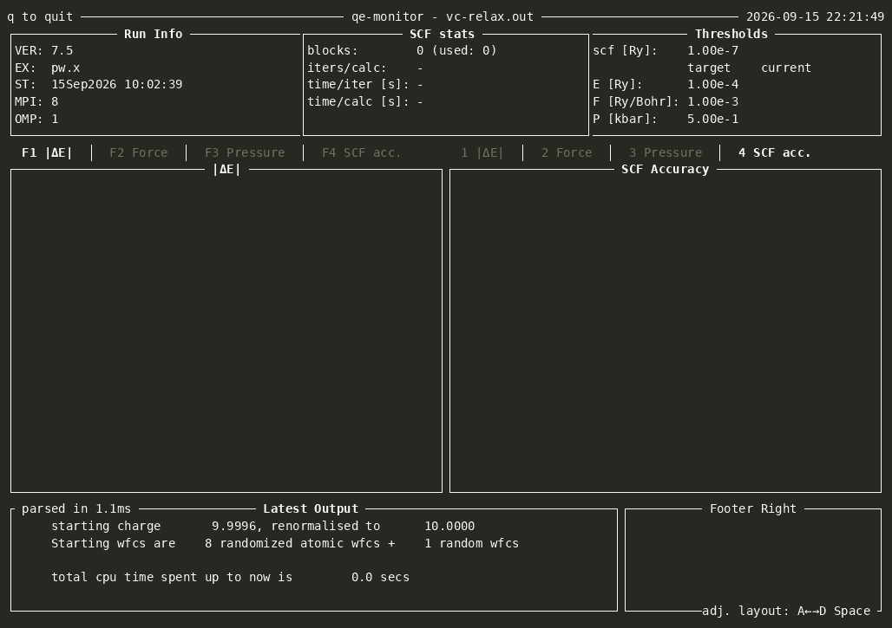

# qe-monitor

A TUI application for monitoring Quantum Espresso and Wannier90 output files in real time. It only relies on the output file and is especially useful to use on remote servers and clusters where using window forwarding can be slow and cumbersome. It is written in Rust and uses [Ratatui](https://ratatui.rs/).



## TUI layout

There is no configuration, the application detects the calculation type from the output file and shows the relevant plots. The layout always consists of a header, two plot panels, and a footer with the raw output and a currently unused panel. The two plot panels can be switched and resized.

## Installation

Needs Rust 1.88 or newer. qe-monitor is not on crates.io, so install it from the
repository:

```sh
cargo install --git https://github.com/kremeyer/qe-monitor
```

That builds the default branch. To pin a release instead:

```sh
cargo install --git https://github.com/kremeyer/qe-monitor --tag v1.0.0
```

Or from a local clone, which is also what you want for development:

```sh
git clone https://github.com/kremeyer/qe-monitor
cd qe-monitor
cargo install --path .
```

All three put the `qe-monitor` binary in `~/.cargo/bin`, which needs to be on your
`PATH`.

## Usage

```sh
qe-monitor [output]
```

qe-monitor checks for appended content in the output file every 250 ms. It is cheap and fast to run on multi-megabyte logs and on files still being written.

| Key | Action |
|---|---|
| `q` | quit |
| `F1`…`F5` | choose the plot in the left panel |
| `1`…`5` | choose the plot in the right panel |
| `Space` | switch between a side-by-side and stacked layout |
| `a` / `d` or `←` / `→` | resize the panels (side-by-side) |
| `w` / `s` or `↑` / `↓` | resize the panels (stacked) |

## License
BSD 3-Clause, see [LICENSE](LICENSE) for details.

The test fixtures under `tests/fixtures` are output files generated from the Quantum Espresso and Wannier90 test-suites. See the respective projects for their licensing.